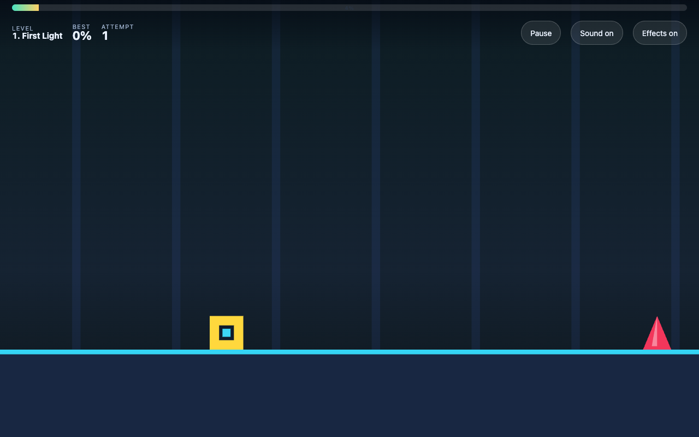
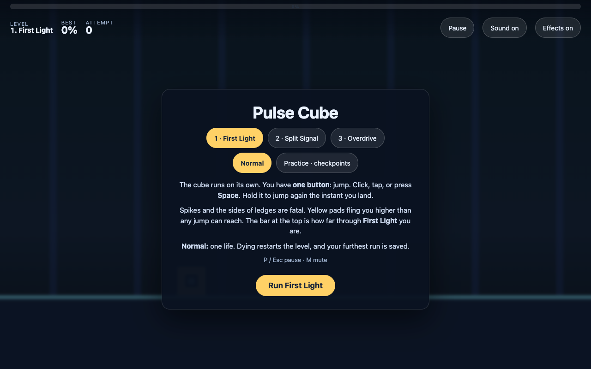
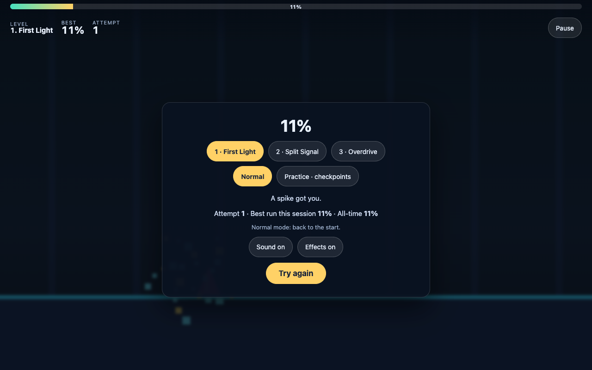
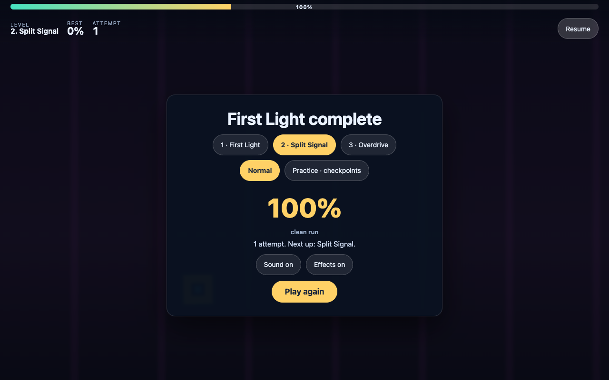
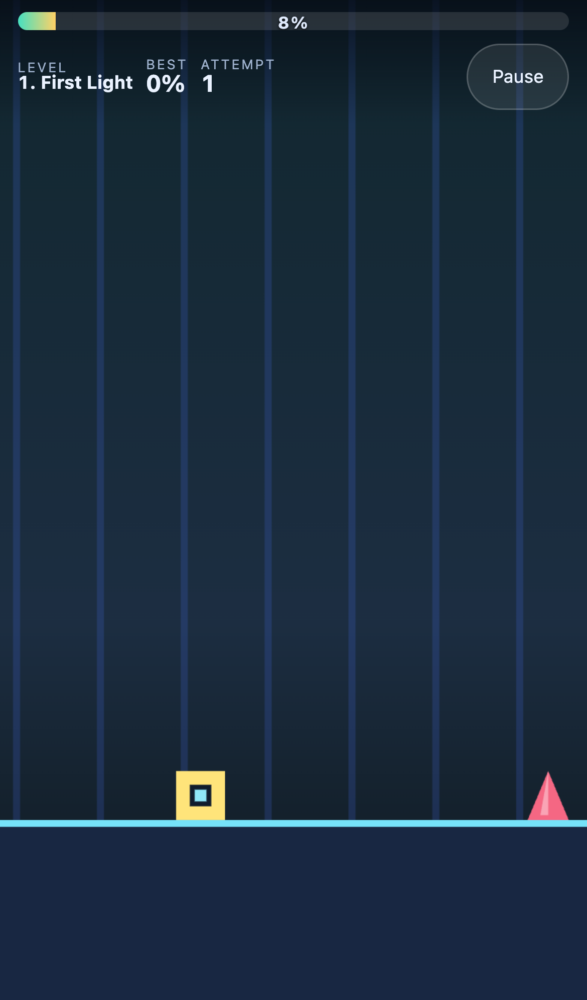

# Pulse Cube

An original one-button auto-running platformer. The cube runs on its own and
never stops; you have exactly one input — jump. Three hand-built levels, a
backing track generated in the browser at each level's own tempo, and a
practice mode with checkpoints for the parts that keep killing you.

Plays on desktop (mouse or keyboard) and on phones (touch). No install, no
backend, no accounts, no ads.



| Menu | Death | Cleared | Phone |
| --- | --- | --- | --- |
|  |  |  |  |

## Gameplay

The cube moves right at a fixed 10.4 cubes per second. Pressing the button
jumps; holding it jumps again the instant you land, which is how you take a run
of obstacles without perfect timing on each one.

- **Spikes** kill on contact.
- **Ledges** are thin: at floor level the cube runs *underneath* them, but
  clouting the **side** of one mid-jump is fatal. Landing on top is how you
  climb.
- **Pads** (yellow) fling the cube higher and further than any jump can reach.
  Long gaps are built around them.
- Falling into a **gap** ends the run.

Two modes:

- **Normal** — one life. Dying restarts the level from the beginning, and your
  furthest run through that level is saved to your browser.
- **Practice** — checkpoint flags along the level become live. Dying puts you
  back at the last flag you passed, and the attempt counter keeps climbing.
  Practice runs never write a best score, because starting from the middle is
  not comparable to a clean run.

The bar across the top is how far through the level you are. The percentage you
died at is the score.

### The three levels

| # | Name | BPM | Length | What is new |
| --- | --- | --- | --- | --- |
| 1 | First Light | 128 | 186 | One obstacle at a time, always with a long run-up. Never two jumps back to back. |
| 2 | Split Signal | 140 | 224 | Gaps and platforms in the same breath, spike pairs, the first two-tier climb, one pad. |
| 3 | Overdrive | 152 | 262 | Triple spikes, back-to-back climbs, spikes standing on platforms, pads over gaps no jump reaches. |

Every obstacle is placed by hand against the actual jump arc, and the test
suite re-derives that arc and then **plays each level with a bot** — so a level
that is not beatable fails the build rather than shipping.

### The beat

There are no audio files. The backing track is scheduled onto the WebAudio
clock — kick on every beat, hat on the off-beat, a bass line over an 8-beat
pattern — at the level's own BPM, and the whole scene (background, spikes,
platform edges, the cube) pulses on the same beat. Because level time is
derived from position (`time = x / SPEED`), a checkpoint respawn drops you back
in on the correct bar instead of restarting the bar at 1.

## Controls

| Action | Desktop | Touch | Keyboard |
| --- | --- | --- | --- |
| Jump | click anywhere | tap anywhere | `Space`, `↑`, `W` or `Enter` |
| Continue / restart | click, or the button | tap, or the button | any jump key |
| Pause / resume | `P` or `Esc`, or the Pause button | Pause button | `P` / `Esc` |
| Mute | `M`, or the Sound button | Sound button (Pause → Sound) | `M` |
| Reduced effects | Effects button (Pause → Effects) | same | — |

The jump button is also "continue" on every non-playing screen, so one finger
drives the whole game.

On a phone only **Pause** sits on the playfield; Sound and Effects live in the
pause panel, because three 44px buttons in the HUD wrapped it onto three rows
and pushed controls over the play area on a 360×640 screen.

A second finger landing while the first is still held **does** jump. Players
drum alternating thumbs, and the press used to fire only on the first source
going down, which silently swallowed that jump. One touch is still exactly one
press, and a buffer re-armed in mid-air cannot double-jump — the buffer only
spends on a grounded or coyote frame.

## Install, dev, build

Requires Node 20+.

```bash
npm ci          # install exactly what the lockfile pins
npm run dev     # http://localhost:5173
npm run build   # tsc --noEmit && vite build  ->  dist/
npm run preview # serve the production build on :4173
npm test        # 31 unit tests (vitest, no browser)
npm run smoke   # 68 browser checks (Playwright); writes docs/*.png
```

`npm run smoke` needs a Chromium: `npx playwright install chromium`.

## Architecture

```
src/
  main.ts            wires DOM elements into Game, exposes window.pulseCube
  style.css          responsive HUD / progress bar / overlay chrome
  game/
    types.ts         state shapes
    config.ts        every tunable number - speed, gravity, jump, camera
    levels.ts        the three levels, as hand-placed geometry
    logic.ts         THE SIMULATION - pure, no DOM, no canvas, no timers
    render.ts        canvas drawing; reads state, writes nothing back
    input.ts         one button, from keyboard and pointer
    audio.ts         WebAudio synthesis + the scheduled beat (no audio files)
    storage.ts       localStorage best-per-level / mute, failure-tolerant
    game.ts          shell: rAF loop, HUD, overlay, pause, level/mode picking
```

The numbers everything else is built on, all in `config.ts`:

```
SPEED   10.4 cubes/s      jump peak      2.60 cubes
GRAVITY 127               jump air time  0.405 s
JUMP_V  25.7              jump covers    4.21 cubes of ground
PAD_V   33.5              pad covers     5.48 cubes
```

Platform tops therefore sit at 2 (reachable from the floor) and 4 (reachable
from a platform at 2); floor gaps stay at or under 2.8 cubes, and only a pad is
ever asked to clear more. Retuning any of those numbers without re-running the
bot test will silently break a level.

Three details worth knowing before changing anything:

- **Collision runs on fixed 1/240s slices**, not on the frame. At 10.4 cubes/s
  a 50ms frame moves the cube half its own width, which is enough to clip the
  corner of a spike or skip a landing entirely.
- **Solid geometry is tested against the exact cube; only spikes get a
  forgiving inset.** Insetting the cube for blocks too leaves a sliver of air
  under it that gravity cannot close within one slice, and the cube falls
  through its own floor. That was a real bug here, caught by the tests.
- **The camera scale is uniform on both axes.** The width is clamped to keep
  the road ahead readable and the height is *derived* from the real aspect
  ratio — fixing both independently stretches the pixels, and a stretched cube
  is a rectangle. That was the second real bug, caught by looking at a phone
  screenshot.

`step()` clamps a single frame delta to 1/20s so a backgrounded tab cannot
resume by teleporting the cube through a wall.

## Verification

Run on macOS (arm64), Node v24.13.0:

```
$ npm test
 Test Files  1 passed (1)
      Tests  31 passed (31)

$ npm run build
✓ built in 87ms      dist/assets/index-*.js 21.0 kB │ gzip 7.6 kB

$ npm run smoke
68/68 checks passed
```

The unit tests cover the jump arc, no double-jumping, the input buffer and
coyote window, all three death causes, checkpoint ordering, practice-vs-normal
respawn, attempt counting, progress and clearing, the camera clamp and uniform
scale, and the frame-delta clamp. They also **play every level with a
one-button lookahead bot** and assert that each one is completable, and that
jumps-per-cube strictly increases from level 1 to 3.

The smoke test drives the real production build in Chromium at 1280×800 and at
an iPhone 13 viewport, asserting against live simulation state rather than
pixels: the cube auto-runs, the progress bar advances, `Space` and a real
click/tap both jump, pause freezes the cube and hides the level picker, dying
throws debris and shows the percentage, normal mode restarts from the start,
reaching the finish clears the level, practice mode respawns exactly at the
last checkpoint and keeps counting attempts, mute round-trips, and no console
errors occur.

Four of those checks cover the multi-touch press: two `PointerEvent`s with
different `pointerId`s are dispatched on `#scene`, and the buffer is asserted
to arm on the second one while the first is still down. They were confirmed to
**fail** on the pre-fix build (`jumpBuffer=0` at both viewports) and pass
after, so they are a real regression guard rather than a tautology.

## Source reference

Inspired by **Geometry Dash Lite** (RobTop Games) —
<https://apps.apple.com/us/app/geometry-dash-lite/id698255242> — as a genre
reference only. This project shares no code, art, audio, level data, names or
branding with it. The levels, the music and every pixel here were written from
scratch for this repository.

## Assets and licence

There are no asset files. Every block, spike, pad, flag and particle is drawn
with Canvas 2D primitives at run time, and every sound — including the backing
track — is synthesised with WebAudio oscillators and generated noise buffers.
Nothing is downloaded, so there is nothing to attribute.

Code: MIT, see [LICENSE](LICENSE).

## Mobile pass — what changed, and what it measured

Baseline is commit `0d9469c`, measured with `scripts/mobile-audit.mjs` before
any of this work. "After" is the same script on the same machine against the
tip of this branch. Both runs use the same build pipeline, the same five
viewports and the same scene (level 1 from the start).

| | Baseline `0d9469c` | After |
| --- | --- | --- |
| Device pixel ratio | 2.5 (uncapped) | **2** |
| Backing store @390×844 | 975×2110 = 2.06 Mpx | **780×1688 = 1.32 Mpx** (−36%) |
| Touch targets under 44 CSS px | **7–8** per viewport (pause, mute, all three level buttons, both mode buttons, at 29–33px tall) | **0** at all five viewports |
| `touch-action` | `none` on `html, body`; `#scene` left `auto` | `manipulation` on `body` (+ `overscroll-behavior: none`), `none` scoped to `#scene` |
| Overlay panel scrollable on a short screen | — | `.panel` stays `overflow-y: auto` |
| HUD height @360×640 | 82px (one row) | 82px (one row) — see note |
| Horizontal overflow | 0px | 0px |
| Reduced-effects mode | none | honours `prefers-reduced-motion`, explicit choice persists |
| Second finger while the first is held | **no jump at all** | jumps |
| Smoke checks | 64 | 68 |

The HUD row is listed as unchanged because it is: raising every target to 44px
*broke* it to three rows / 134px with Sound and Effects floating over the
playfield, and moving those two into the pause panel brought it back to one
row. That regression was caught by looking at a screenshot, not by an
assertion, which is worth saying out loud.

### Frame timing — read this before quoting the numbers

`scripts/mobile-audit.mjs` records a 60-second frame-interval distribution
after warmup at each viewport. **These numbers are not evidence of smooth
60 Hz and must not be quoted as an FPS guarantee.** Headless Chromium drives
`requestAnimationFrame` at roughly 30 Hz, so the floor of the distribution is
the harness, not the game:

```
portrait-360x640   n=1539  p50=33.4ms  p95=66.7ms  p99=66.8ms  max=116.7ms  peak particles=26
portrait-390x844   n=1574  p50=33.3ms  p95=66.7ms  p99=66.8ms  max=83.3ms   peak particles=26
```

`p50 ≈ 33.3ms` is identical at baseline and after. The only thing this
distribution is good for is a **same-machine regression signal**: if a change
made the loop meaningfully more expensive, the tail would move. It did not.
Real 60 Hz behaviour on real hardware is **untested** — see the limitations.

Particle count is bounded by construction rather than by a cap: a death emits
exactly 26 pieces, there is one death per run, and the array is cleared on
reset and filtered by lifetime. `peak particles=26` across every 60s run
confirms it.

### Reduced effects and determinism

The Effects button (and `prefers-reduced-motion` when no explicit choice is
stored) suppresses camera shake, the beat pulse and the death-debris **drawing
only**. `state.shake`, `state.particles` and the beat value are all still
simulated and still advance identically, so collision and scoring are
unchanged between the two modes. Verified by playing both: the run dies on the
same spike, with the same cause, at x = 21.36 vs 21.38 (frame-timing jitter),
with 26 particles simulated in both.

The beat is a brightness pulse, not a full-screen flash, and reduced mode
removes it entirely. Nothing in the game strobes.

## Known limitations

- **Portrait phones show a lot of empty sky.** Keeping the pixel scale uniform
  and the road ahead wide enough to react to forces it; landscape is the better
  orientation on a phone. Letterboxing the playfield would fix it and is not
  done.
- **Three levels, no editor.** There is no level format on disk and no way to
  add a level without editing `levels.ts` and re-running the bot test.
- No coins, no ship/wave sections, no speed portals — the mechanic set stops at
  jump, land, pad.
- Best progress is per-browser `localStorage`, per level, no accounts or
  leaderboard. Private-browsing modes that block storage fall back to
  session-only bests.
- The beat is generated but the *level* is not generated from it: obstacles are
  spaced to feel on-tempo, not snapped to a grid derived from the BPM.
- Audio needs a user gesture to start (browser autoplay policy), so the track
  begins on the first tap or key press.
- **No real device was ever used.** Every mobile result in this README comes
  from Playwright viewport emulation in headless Chromium. That is not an
  iPhone and not an Android phone. Real Safari (including its address-bar
  resize, safe-area insets and audio-unlock behaviour) and real Android Chrome
  are **completely untested**.
- **The frame-interval numbers are not an FPS claim.** Headless rAF runs at
  ~30 Hz, so `p50 ≈ 33.3ms` is the harness floor at baseline *and* after. Use
  them only as a same-machine regression signal.
- **The multi-touch fix is verified with synthetic `PointerEvent`s**, not with
  two real fingers on a real screen. The smoke check was confirmed to fail on
  the pre-fix build and pass after, which proves the logic — not the hardware
  path.
- No memory trend was measured over a long session; only peak particle count
  is bounded and asserted.
- Safe-area insets (`env(safe-area-inset-*)`) are not applied, so a notched
  phone in landscape is untested territory.
- `npm audit` reports two advisories, both devDependency-only and neither
  reachable from the shipped bundle: `esbuild` via Vite 5's dev server, and
  Playwright's `<1.55` downloader. They are left unforced rather than pinned
  past what the lockfile resolves.
